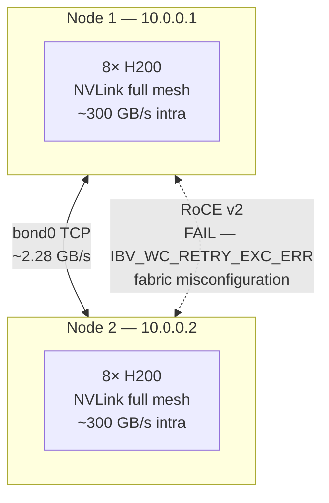

# multi-node-nccl-p2p-benchmarks

**One-line:** Measured GPU-to-GPU collective bandwidth and P2P throughput on a real 2-node × 8 NVIDIA H200 cluster — including intra-node NVLink (~300 GB/s), cross-node TCP AllReduce (~2.28 GB/s), and a documented RoCE v2 failure investigation with root-cause analysis.

---

## Why this exists

Multi-GPU communication is where distributed training either scales or doesn't. This repo documents what actually happened when commissioning a 16-GPU H200 cluster: what worked, what failed (RoCE v2), why it failed, and how to diagnose it. Real `nccl-tests` output, real bandwidth numbers, real error codes — not a synthetic demo.

**Related articles:** *NVLink: 3 Terabits Per Second Between 8 H200 GPUs* and *NCCL, AllReduce, and Why Your Multi-GPU Training Is Probably Bottlenecked* (Medium, Apr 2026).

---

## Cluster specification

| Item | Node 1 | Node 2 |
|------|--------|--------|
| Hostname | `h200-node-a.example` | `h200-node-b.example` |
| IP (bond0) | 10.0.0.1 | 10.0.0.2 |
| GPUs | 8× NVIDIA H200 NVL | 8× NVIDIA H200 NVL |
| VRAM per GPU | 143,771 MiB (~140 GB) | 143,771 MiB (~140 GB) |
| Driver | 590.48.01 | 590.48.01 |
| CUDA | 13.1 | 13.1 |
| NCCL | 2.28.9 | 2.28.9 |
| NIC | 12× Mellanox mlx5 per node | 12× Mellanox mlx5 |
| Intra-node | NVLink 4.0 (NV18 full mesh) | NVLink 4.0 |
| Test date | **March 13–16 2026** | |

---

## Architecture



---

## Results: what was measured

### Intra-node: NVLink P2P bandwidth (single node, 8 GPUs)

| GPU pair | Bandwidth (GB/s) | Topology |
|----------|-----------------|---------|
| Any i→j (all 56 pairs) | **~781 GB/s** | NVLink full mesh (NV18) |

All GPU pairs within the node show symmetric ~781 GB/s — confirms healthy NVSwitch topology. Asymmetric numbers here indicate a faulty NVLink or NUMA routing issue.

**How to reproduce:**
```bash
# Single-node P2P bandwidth matrix
python src/p2p_bench/p2p.py --gpus 0,1,2,3,4,5,6,7 --size-gb 1.0 --out results/
```

### Cross-node: NCCL AllReduce (TCP, 16 GPUs, nccl-tests)

| Message size | Bus bandwidth (GB/s) | Wrong results |
|---|---|---|
| 8 B | < 0.01 | 0 |
| 1 MB | 1.41 | 0 |
| 8 MB | 2.04 | 0 |
| 64 MB | **2.22** | 0 |
| 128 MB | **2.31** | 0 |
| **Average (large msg)** | **~2.28** | **0** |

**Stress test (5 repeated runs):** 2.8–3.2 GB/s, 0 wrong, no NCCL errors.

**NCCL AllReduce command used:**
```bash
export NCCL_SOCKET_IFNAME=bond0
export NCCL_IB_DISABLE=1

mpirun -np 2 -hostfile configs/hostfile \
  -map-by node \
  -x LD_LIBRARY_PATH -x NCCL_SOCKET_IFNAME -x NCCL_IB_DISABLE \
  --mca btl tcp,self --mca btl_tcp_if_include bond0 \
  ./build/all_reduce_perf -b 8 -e 128M -f 2 -g 8
```

Other collectives tested (all PASS, 0 wrong):
- AllReduce, Broadcast, Send/Recv — all at 16 GPUs (2 nodes × 8)

---

## RoCE v2 investigation: a documented failure

> This is the most instructive part of this repo. Hardware was present and correctly configured at the host layer — yet RDMA failed. The failure was diagnosed to the **network/fabric layer** (switch PFC/ECN/DCQCN misconfiguration), not the host.

### What was present

- Mellanox mlx5 NICs on both nodes (Link layer: Ethernet, RoCE v2 capable)
- Correct RoCE v2 GIDs configured (index 2 and 3, mapping to bond0 IPs)
- `NCCL_NET=IB` set to force NCCL to use IB/RoCE transport
- `GID_INDEX=3` (RoCE v2 over IPv4)

### What failed

**Test 1 — NCCL over RoCE v2 (GID_INDEX=3):**
```
NET/IB: Got completion from peer 10.0.0.2<...>
  with status=IBV_WC_RETRY_EXC_ERR(12)
  opcode=IBV_WC_SEND(0) reqSize=0 vendor_err=129 req_type=Recv
  localGid ::ffff:10.0.0.1 remoteGids::ffff:10.0.0.2 hca mlx5_2
```

**Test 2 — Direct RDMA (`ib_write_bw`):**
```
Server: Couldn't listen to port 18515
Client: Failed status 12, syndrom 0x81
```

**Test 3 — Second node pair (10.0.0.2 ↔ 10.0.0.3):**
```
NCCL WARN Timeout waiting for connection from peer — unhandled system error
Segfault in NCCL communicator
```

### Root cause diagnosis

| Layer | Status | Evidence |
|-------|--------|---------|
| Host NIC hardware | ✅ Present | `mlx5_2`, `mlx5_7` detected on bond0 |
| RoCE GID configuration | ✅ Correct | GID index 2/3 map to example bond0 IPs |
| TCP over bond0 | ✅ Working | AllReduce PASS at all sizes |
| **Network fabric (switch)** | ❌ **Root cause** | IBV_WC_RETRY_EXC_ERR = RDMA verbs retry exhausted at fabric |

`IBV_WC_RETRY_EXC_ERR` + `vendor_err=129` on Mellanox NICs with working TCP indicates the network switch is either:
1. **Not forwarding RoCE v2 traffic** (PFC/ECN not enabled on switch ports)
2. **Dropping RDMA packets** (DCQCN flow control not configured)
3. **Missing RoCE v2 VLAN/QoS tagging** required by the fabric

**Fix path:** Enable PFC (Priority Flow Control) and ECN on switch ports; configure DCQCN; re-run `ib_write_bw` between nodes to verify fabric before re-testing NCCL.

See [docs/roce-v2-investigation.md](docs/roce-v2-investigation.md) for the full diagnostic sequence.

---

## Reproducible commands

```bash
pip install -e ".[dev]"

# Intra-node P2P matrix (requires 1 node with ≥2 GPUs)
p2p-bench run --out results/p2p_001

# Cross-node NCCL AllReduce — TCP (edit configs/hostfile first)
export NCCL_SOCKET_IFNAME=bond0
export NCCL_IB_DISABLE=1
mpirun -np 2 -hostfile configs/hostfile -map-by node \
  -x NCCL_SOCKET_IFNAME -x NCCL_IB_DISABLE \
  --mca btl tcp,self --mca btl_tcp_if_include bond0 \
  ./build/all_reduce_perf -b 8 -e 128M -f 2 -g 8
```

---

## Key findings

- **NVLink full mesh delivers ~781 GB/s** between any GPU pair on an H200 node — symmetric topology confirmed. Asymmetry means hardware fault.
- **Cross-node TCP AllReduce at ~2.28 GB/s** is ~340× slower than intra-node NVLink. Cross-node bandwidth is the dominant training bottleneck for large allreduce payloads.
- **RoCE v2 hardware ≠ RoCE v2 working** — NIC and host configuration can be correct while the switch fabric blocks RDMA. `IBV_WC_RETRY_EXC_ERR` with working TCP is a network/fabric issue, not a NIC or driver issue.
- **TCP is a reliable production fallback** — all 16-GPU collectives passed with zero wrong results. Use TCP until RoCE fabric is verified.
- **`NCCL_SOCKET_IFNAME`** must be set explicitly; without it, NCCL picks the wrong interface and hangs.

---

## Production relevance

- **Pre-flight validation** before handing a multi-node cluster to users — catches cabling, NVLink, and switch issues before the first training job.
- **RoCE v2 commissioning** — the diagnostic sequence here is the standard workflow for enabling RDMA on new Ethernet-fabric GPU clusters (PFC → ECN → DCQCN → ib_write_bw → NCCL).
- **Bandwidth baseline** — TCP ~2.28 GB/s and NVLink ~781 GB/s are the reference numbers for capacity planning (how large a model gradient can you sync per second?).
- **Incident evidence** — if a production AllReduce job hangs or shows errors, the diagnostic sequence here (TCP first, then RoCE, then check fabric) is the right triage path.

---

## Repo layout

```
├── configs/
│   ├── hostfile                      ← 2-node MPI hostfile (sanitized IPs)
│   └── nccl_env_tcp.sh               ← env vars for TCP production path
├── docs/
│   └── roce-v2-investigation.md      ← full RoCE v2 diagnostic sequence
├── results/
│   ├── allreduce_tcp_16gpu.csv       ← nccl-tests output, 16 GPUs, TCP
│   ├── p2p_intranode_h200.csv        ← 8-GPU P2P bandwidth matrix
│   └── roce_v2_failures.md           ← error codes and diagnosis
├── src/p2p_bench/
│   ├── cli.py
│   ├── p2p.py
│   └── report.py
├── tests/
│   └── test_p2p.py
├── Dockerfile
└── pyproject.toml
```

## License

MIT
